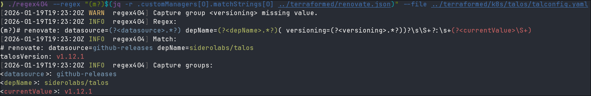

= Regex404

A CLI-tool inspired by https://regex101.com[regex101.com], to make it easier
to test changes to the expression and how it affects the match.

== Use Cases

Testing the matching of regex custom managers in the configuration file of of renovatebot.

Bonus: Extracting the expression directly from the renovate config file.

Example:

```
regex404 \
        --regex "(m?)$(jq -r .customManagers[0].matchStrings[0] renovate.json)" \
        --file talos/talconfig.yaml
```

Output:

```
[2026-01-19T19:45:58Z WARN  regex404] Capture group <versioning> missing value.
[2026-01-19T19:45:58Z INFO  regex404] Regex:
(m?)# renovate: datasource=(?<datasource>.*?) depName=(?<depName>.*?)( versioning=(?<versioning>.*?))?\s\S+?:\s+(?<currentValue>\S+)
[2026-01-19T19:45:58Z INFO  regex404] Match:
# renovate: datasource=github-releases depName=siderolabs/talos
talosVersion: v1.12.1
[2026-01-19T19:45:58Z INFO  regex404] Capture groups:
<datasource>: github-releases
<depName>: siderolabs/talos
<currentValue>: v1.12.1
```


